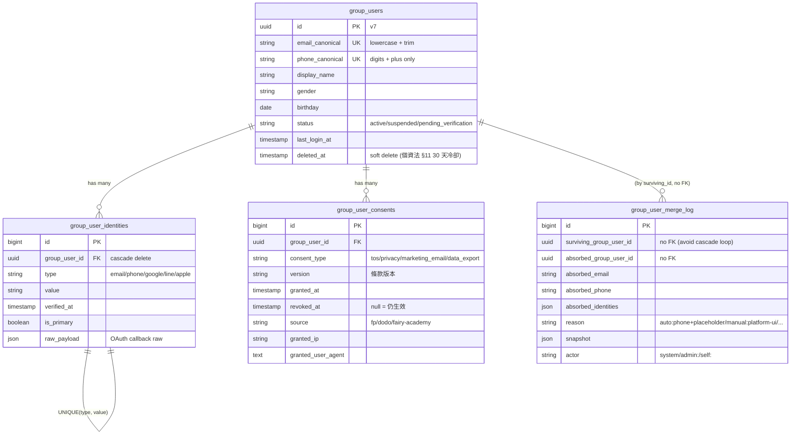

# Pandora Core Identity Service

> 集團（潘朵拉 / Pandora）單一身份源 — 跨所有 App 的 user / OAuth / JWT / 帳號合併 / consent 管理。

**狀態**：✅ **Production**（2026-04-28 上線；Phase 1-4 + A-E 漸進切換全部完成；49/50 母艦客戶已遷移）
**技術棧**：Laravel 13 + MariaDB 10.11（與母艦婕樂纖同棧）
**部署**：`https://id.js-store.com.tw` — Linode 同台 4GB（與母艦共住）+ Let's Encrypt + systemd cron schedule:run + daily mysqldump 備份
**主要 ADR**：
  - [ADR-007 同步策略修訂](../docs/adr/ADR-007-identity-sync-strategy-revision.md) — **最新 baseline，必讀**
  - [ADR-001 Identity Service](../docs/adr/ADR-001-identity-service.md) — 部分作廢（§2 §3 仍生效）
  - [ADR-006 部署選型](../docs/adr/ADR-006-identity-deployment.md) — Deferred（升雲觸發條件未達）

---

## 為什麼存在

集團商業模式 = **婕樂纖（FP, 母艦）+ 多個 AI App（豆豆 / 月曆 / 肌膚 / 學院 ...）**。
所有 App 必須共用同一個會員身份，才能：

1. 做「**愛用者 → 加盟者**」漏斗轉換（ADR-003，集團 #1 獲利槓桿）
2. 滿足個資法 §11 §27（一鍵下載 / 一鍵刪除集團帳號）
3. 避免每個 App 各做一套 user table（合併成本 6 個月後 3-5 倍）

## 抽什麼出來

| 上移到本服務 | 留在各 App |
|---|---|
| 登入身份（email / phone / OAuth tokens） | 訂單、地址、收件人、會員等級 |
| 帳號合併歷史 / consent 紀錄 | AI 對話、訂閱、寵物資料 |
| 全集團通用 profile（姓名 / 性別 / 生日） | 推薦碼、加盟狀態等產品自治資料 |

## 主要 API（v1）

```
POST   /v1/auth/login              OAuth / email-password 登入
POST   /v1/auth/refresh            Refresh token rotation
POST   /v1/auth/logout
GET    /v1/users/me                取自己的 group profile
PATCH  /v1/users/me                改通用 profile
POST   /v1/users/me/merge          帳號合併
GET    /v1/users/me/export         個資法一鍵下載
DELETE /v1/users/me                個資法一鍵刪除（軟刪 + 30 天）

Webhooks → 各 App
  user.created / user.updated / user.merged / user.deleted / consent.changed
```

JWT 採 **RS256**，各 App 只驗 public key 不打 Identity API。

## 資料模型（Issue #2 完成）



**對齊婕樂纖既有 schema**：`group_user_identities` 1:1 mapping `customer_identities`、`group_user_merge_log` 1:1 mapping `customer_merge_log`，方便 Step 1 鏡寫不需要 transformer 邏輯。

## Migration 結果（2026-04-28 完成）

ADR-001 原 6-Step 10 週 dual-write 計畫**作廢**（cross-check 後實際 < 10 真實客戶，無需灰度）。改採 ADR-007 的 4-Phase + A-E 漸進切換，**一日內完成**：

| Phase | 內容 | PR |
|---|---|---|
| 1 | Platform outbox + webhook publisher | [pandora-core-identity #12](https://github.com/freeco-company/pandora-core-identity/pull/12) ✅ |
| 2 | 母艦 webhook receiver + backfill | [pandora-js-store #13](https://github.com/freeco-company/pandora-js-store/pull/13) ✅ |
| 3 | 母艦 OAuth cutover（legacy/shadow/cutover 三模式 + 4 道防線） | [pandora-js-store #14](https://github.com/freeco-company/pandora-js-store/pull/14) ✅ |
| 4 | 朵朵 IdentityClient SDK + minimal mirror | [dodo #2](https://github.com/freeco-company/dodo/pull/2) ✅ |

A-E 漸進切換（同日）：接通 wiring → backfill 49/50 客戶 → shadow → canary（whitelist 4 個自己 email 24h）→ full cutover（whitelist 清空，全 50 客戶走 platform）。

**End State**：
```
Pandora Core Identity (single source of truth, 含完整 PII)
    ↓ webhook publisher (HMAC + retry + dead_letter)
母艦 customers (read-only mirror，完整 PII，供客服/出貨/加盟)
朵朵 dodo_users (minimal mirror：uuid + display + tier，無 PII)
```

詳見 [ADR-007](../docs/adr/ADR-007-identity-sync-strategy-revision.md)、[HANDOFF.md §B](../HANDOFF.md)。

## 不做什麼

- ❌ 不做產品內部資料（訂單、AI 對話、訂閱狀態各 App 自治）
- ❌ 不做 fairysalebox 加盟商後台（內部 CRM，不在本服務範圍）
- ❌ 不做支付（ECPay / IAP 留在各 App）
- ❌ 不做仙女幣 / 點數（另一個 ADR 範圍）

## 目錄定位

本目錄是集團 monorepo（`/pandora/`）下的 working copy，獨立 GitHub repo `freeco-company/pandora-core-identity`，獨立部署。集團共用文件在 `../docs/`。

---

## 🛠 Local Development

### Prerequisites

- PHP 8.3+
- Composer 2.x
- MariaDB 10.11+（建議 `brew install mariadb`；母艦 pandora.js-store 已在用同一份）
- Redis 7+（`brew install redis && brew services start redis`）— Phase 1 後 outbox / token blacklist 會用

### Setup

```bash
# 1. 安裝依賴
composer install

# 2. 環境設定
cp .env.example .env
php artisan key:generate

# 3. 建 DB（沿用母艦 root 密碼）
mariadb -u root -p -e "CREATE DATABASE IF NOT EXISTS pandora_core_identity CHARACTER SET utf8mb4 COLLATE utf8mb4_unicode_ci;"

# 4. 編輯 .env 設定 DB_PASSWORD（與母艦相同）

# 5. Migrate
php artisan migrate

# 6. 啟動
php artisan serve --port=8001
```

### Quality gates（CI 會跑）

```bash
./vendor/bin/pint --test          # 程式碼風格
./vendor/bin/phpstan analyse      # 靜態分析（level 6）
php artisan test                  # PHPUnit
```

CI 設定見 `.github/workflows/ci.yml`。

### 已安裝主要套件

| Package | 用途 | 對應 issue |
|---|---|---|
| `laravel/sanctum` | Token issuance wrapper | #3 |
| `laravel/horizon` | Queue worker monitoring（outbox / webhook） | Step 2 |
| `lcobucci/jwt` | RS256 JWT 簽發 / 驗證 | #3 |
| `symfony/uid` | UUID v7（`group_user_id` 主鍵） | #2 |
| `larastan/larastan` (dev) | PHPStan + Laravel rules | CI |
| `laravel/pint` (dev) | Code style | CI |
